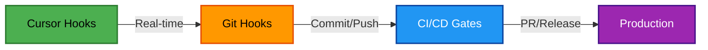

# Cursor Hooks Integration Guide

> **Complete guide to using Cursor hooks with CAWS for real-time quality gates**  
> **Author**: @darianrosebrook

## Overview

Cursor hooks provide real-time quality gates during AI-assisted coding sessions. They complement CAWS's existing git hooks and CI/CD gates by catching issues **as you code**, not just when you commit.

## Three-Tier Quality Approach

CAWS uses a layered quality strategy:



1. **Cursor Hooks** (< 500ms) - Instant feedback as AI codes
2. **Git Hooks** (< 60s) - Validation before sharing
3. **CI/CD** (< 10min) - Comprehensive gates before merge

## Installation

### Automatic Setup (Recommended)

When creating a new CAWS project:

```bash
caws init my-project --interactive
```

You'll be prompted:
```
📌 Enable Cursor hooks for real-time quality gates? (Y/n)
📌 Which Cursor hooks should be enabled?
  ◉ Safety (secrets, PII, dangerous commands)
  ◉ Quality (formatting, linting, validation)
  ◉ Scope guards (file scope, naming conventions)
  ◉ Audit trail (provenance tracking)
```

### Manual Setup (Existing Projects)

For existing CAWS projects:

```bash
cd my-existing-project
caws scaffold
```

Or copy manually:

```bash
# Copy from CAWS templates
cp -r packages/caws-cli/templates/.cursor .cursor
chmod +x .cursor/hooks/*.sh

# Restart Cursor
```

## Hook Events & Scripts

### Safety Hooks

#### beforeShellExecution: `block-dangerous.sh`

Prevents dangerous commands from executing:

**Hard Blocks** (never allowed):
- `rm -rf /` - Root filesystem deletion
- `DROP DATABASE` - SQL database deletion
- `mkfs` - Filesystem formatting
- `dd if=` - Direct disk writes

**Requires Permission** (ask user first):
- `rm -rf` - Recursive deletion
- `git push --force` - Force push
- `npm publish` - Package publishing
- `kubectl delete` - Kubernetes deletion
- `terraform destroy` - Infrastructure destruction

**Example Output**:
```json
{
  "permission": "deny",
  "userMessage": "⚠️ BLOCKED: Dangerous command detected",
  "agentMessage": "This command is blocked for safety"
}
```

#### beforeReadFile: `scan-secrets.sh`

Prevents AI from reading sensitive files:

**Blocked Files**:
- `.env`, `.env.local`, `.env.production`
- `*.pem`, `*.key`, `*.p12`, `*.pfx`
- `*.cert`, `*.crt`

**Warned Patterns** (allowed with warning):
- API keys: `api_key`, `apiKey`, `AKIA...`
- Secrets: `secret_key`, `password`, `bearer`
- PII: SSN patterns, credit card numbers

**Example Output**:
```json
{
  "permission": "deny",
  "userMessage": "⚠️ Blocked: Environment files contain secrets"
}
```

### Quality Hooks

#### afterFileEdit: `format.sh`

Auto-formats edited files:

**Supported Formatters**:
- **Prettier**: JS, TS, JSON, MD, YAML
- **ESLint**: JS, TS with `--fix`

**Behavior**:
- Non-blocking (always allows edit)
- Runs after every file save
- Uses project config (`.prettierrc`, `.eslintrc`)

#### afterFileEdit: `validate-spec.sh`

Validates `working-spec.yaml` on edit:

**Checks**:
- Schema validation
- Required fields
- Risk tier constraints
- Budget limits

**Example Output**:
```json
{
  "userMessage": "⚠️ CAWS spec validation failed. Run: caws validate --suggestions",
  "agentMessage": "The working-spec.yaml has validation errors"
}
```

### Scope Hooks

#### afterFileEdit: `naming-check.sh`

Enforces CAWS naming conventions:

**Banned Patterns**:
- `enhanced-*` / `*-enhanced`
- `unified-*` / `*-unified`
- `better-*` / `*-better`
- `new-*` / `*-new`
- `final-*` / `*-final`
- `*-copy` / `copy-*`
- `*-revamp` / `revamp-*`

**Example Output**:
```json
{
  "userMessage": "⚠️ Naming violation: File contains 'enhanced-'. Use purpose-driven names.",
  "agentMessage": "Please rename with a specific, purpose-driven name"
}
```

#### beforeSubmitPrompt: `scope-guard.sh`

Checks if files are within `working-spec.yaml` scope:

**Checks**:
- Attached files against `scope.in`
- Warns if files outside defined scope
- Non-blocking (allows with warning)

**Example Output**:
```json
{
  "continue": true,
  "userMessage": "⚠️ Warning: Some files may be outside scope",
  "agentMessage": "Consider updating scope in working-spec.yaml"
}
```

### Audit Hooks

#### All Events: `audit.sh`

Logs all Cursor AI interactions:

**Logged Data**:
- Timestamp (ISO 8601)
- Event type (beforeShellExecution, afterFileEdit, etc.)
- Conversation ID
- Generation ID
- Full event payload

**Log Location**: `.cursor/logs/audit-YYYY-MM-DD.log`

**Integration**: Calls `apps/tools/caws/provenance.js` if available

## Configuration

### hooks.json Structure

```json
{
  "version": 1,
  "hooks": {
    "beforeShellExecution": [
      { "command": "./.cursor/hooks/block-dangerous.sh" },
      { "command": "./.cursor/hooks/audit.sh" }
    ],
    "beforeMCPExecution": [
      { "command": "./.cursor/hooks/audit.sh" }
    ],
    "beforeReadFile": [
      { "command": "./.cursor/hooks/scan-secrets.sh" }
    ],
    "afterFileEdit": [
      { "command": "./.cursor/hooks/format.sh" },
      { "command": "./.cursor/hooks/naming-check.sh" },
      { "command": "./.cursor/hooks/validate-spec.sh" },
      { "command": "./.cursor/hooks/audit.sh" }
    ],
    "beforeSubmitPrompt": [
      { "command": "./.cursor/hooks/scope-guard.sh" },
      { "command": "./.cursor/hooks/audit.sh" }
    ],
    "stop": [
      { "command": "./.cursor/hooks/audit.sh" }
    ]
  }
}
```

### Customize Hook Levels

Edit `hooks.json` to enable/disable specific hooks:

```json
{
  "hooks": {
    "afterFileEdit": [
      // Keep formatting
      { "command": "./.cursor/hooks/format.sh" },
      // Disable naming check (comment out)
      // { "command": "./.cursor/hooks/naming-check.sh" }
    ]
  }
}
```

### Temporarily Disable Hooks

**Option 1**: Via Cursor UI
1. Open Cursor Settings
2. Navigate to Hooks tab
3. Toggle "Enable Hooks" off

**Option 2**: Rename config
```bash
mv .cursor/hooks.json .cursor/hooks.json.disabled
# Restart Cursor
```

**Option 3**: Per-hook disable
```bash
# Make hook non-executable
chmod -x .cursor/hooks/naming-check.sh
```

## Debugging Hooks

### Check Hook Status

1. Open Cursor Settings → Hooks tab
2. View configured hooks
3. See execution history
4. Check for errors

### View Hook Logs

```bash
# Today's audit log
cat .cursor/logs/audit-$(date +%Y-%m-%d).log | jq

# All logs
ls -lh .cursor/logs/

# Last 10 events
tail -n 10 .cursor/logs/audit-*.log | jq
```

### Test Hook Manually

```bash
# Test with sample input
echo '{"file_path":"test.js","content":"console.log()"}' | \
  .cursor/hooks/format.sh

# Test dangerous command blocker
echo '{"command":"rm -rf /"}' | \
  .cursor/hooks/block-dangerous.sh
```

### Common Issues

#### Hook not executing?
- Restart Cursor after editing `hooks.json`
- Check script is executable: `ls -l .cursor/hooks/*.sh`
- Verify `jq` is installed: `which jq`

#### Hook blocking valid operation?
- Check Cursor output channel for hook messages
- Review `.cursor/logs/` for details
- Temporarily disable specific hook

#### Hook too slow?
- Remove expensive operations (e.g., full lint)
- Use `--quiet` flags for faster execution
- Move slow checks to git hooks

## Writing Custom Hooks

### Hook Script Template

```bash
#!/bin/bash
# Custom Hook: Description
# Event: afterFileEdit

set -euo pipefail

# Read JSON input from Cursor
INPUT=$(cat)

# Extract fields
FILE_PATH=$(echo "$INPUT" | jq -r '.file_path // ""')

# Your logic here
if [[ "$FILE_PATH" == *.test.js ]]; then
  # Do something
  true
fi

# Return JSON response
echo '{"permission":"allow"}' 2>/dev/null
exit 0
```

### Hook Input Schema

All hooks receive:
```json
{
  "conversation_id": "abc123",
  "generation_id": "gen456",
  "hook_event_name": "afterFileEdit",
  "workspace_roots": ["/path/to/project"]
}
```

Event-specific fields:
- `beforeShellExecution`: `command`, `cwd`
- `beforeMCPExecution`: `tool_name`, `tool_input`
- `beforeReadFile`: `file_path`, `content`, `attachments`
- `afterFileEdit`: `file_path`, `edits`
- `beforeSubmitPrompt`: `prompt`, `attachments`
- `stop`: `status`

### Hook Output Schema

**Permission Decisions** (beforeShellExecution, beforeMCPExecution, beforeReadFile):
```json
{
  "permission": "allow" | "deny" | "ask",
  "userMessage": "Optional message to user",
  "agentMessage": "Optional message to AI"
}
```

**Continue Decisions** (beforeSubmitPrompt):
```json
{
  "continue": true | false,
  "userMessage": "Optional warning"
}
```

**Observation Only** (afterFileEdit, stop):
- No response required
- Exit 0 to continue

## Best Practices

### Do's

1. **Keep hooks fast** - Target < 500ms for real-time feedback
2. **Fail gracefully** - Always exit 0, even on internal errors
3. **Use warnings over blocks** - Reserve blocks for truly dangerous operations
4. **Log for debugging** - Write to `.cursor/logs/` for investigation
5. **Test manually** - Verify with sample JSON before committing

### Don'ts

1. **Don't block everything** - Over-blocking frustrates developers
2. **Don't run expensive operations** - Move heavy checks to git hooks
3. **Don't assume tools exist** - Check for `jq`, `prettier`, etc.
4. **Don't leak errors** - Redirect stderr to avoid breaking Cursor
5. **Don't duplicate git hooks** - Hooks complement, not replace

## Integration with CAWS Tools

### Calling CAWS Validators

```bash
# Validate spec
if [ -f "apps/tools/caws/validate.js" ]; then
  node apps/tools/caws/validate.js --quiet
fi

# Check scope
if [ -f "apps/tools/caws/scope-guard.js" ]; then
  node apps/tools/caws/scope-guard.js check "$FILE_PATH"
fi

# Run gates
if [ -f "apps/tools/caws/gates.js" ]; then
  node apps/tools/caws/gates.js --hook-mode
fi
```

### Provenance Logging

```bash
# Log to provenance
if [ -f "apps/tools/caws/provenance.js" ]; then
  node apps/tools/caws/provenance.js log-event \
    --event="$HOOK_EVENT" \
    --conversation="$CONVERSATION_ID"
fi
```

## Performance Targets

| Hook Type | Target | Max | Notes |
|-----------|--------|-----|-------|
| Safety | < 100ms | 500ms | Fast pattern matching |
| Quality | < 500ms | 2s | Run formatters |
| Scope | < 200ms | 1s | Check patterns/files |
| Audit | < 50ms | 200ms | Append to log |

## Comparison with Git Hooks

| Feature | Cursor Hooks | Git Hooks |
|---------|--------------|-----------|
| **Timing** | Real-time (as you code) | On commit/push |
| **Speed** | < 500ms | < 60s |
| **Depth** | Quick checks | Comprehensive |
| **Skippable** | Via Cursor UI | `--no-verify` |
| **Scope** | Current edit | All staged files |
| **Purpose** | Instant feedback | Pre-commit validation |

## Resources

- [Cursor Hooks Documentation](https://docs.cursor.com/advanced/hooks)
- [CAWS Hook Strategy](./HOOK_STRATEGY.md)
- [CAWS Developer Guide](./caws-developer-guide.md)
- [Git Hooks vs Cursor Hooks](./HOOK_STRATEGY.md#hook-placement-matrix)

## FAQ

### Q: Do Cursor hooks replace git hooks?
**A**: No. Cursor hooks provide **real-time** feedback, git hooks provide **commit-time** validation. Use both.

### Q: Can I use Cursor hooks with Windsurf or VS Code?
**A**: No. Cursor hooks are a Cursor-specific feature. However, the CAWS git hooks and CI/CD gates work everywhere.

### Q: How do I test hooks before committing?
**A**: Run manually with sample JSON:
```bash
echo '{"file_path":"test.js"}' | .cursor/hooks/format.sh
```

### Q: Why are hooks non-blocking by default?
**A**: To avoid frustrating developers. Warnings educate without interrupting flow. Reserve blocks for truly dangerous operations.

### Q: Can I share hooks across my team?
**A**: Yes! `.cursor/` is in version control. Everyone gets the same hooks when they clone.

### Q: How do I update hooks after CAWS CLI update?
**A**: Run `caws scaffold` in your project directory to refresh hooks.

---

**Last Updated**: October 3, 2025  
**Version**: 1.0.0  
**Author**: @darianrosebrook

