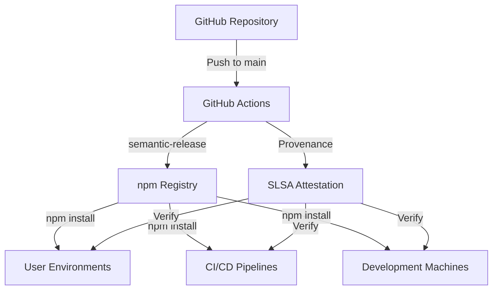

# CAWS Production Deployment Guide

**Author**: @darianrosebrook  
**Last Updated**: October 10, 2025  
**Status**: Production Ready

## Overview

This guide covers deploying CAWS to production environments. CAWS is primarily distributed as npm packages, but this guide also covers deployment considerations for teams running internal instances.

---

## Deployment Architecture

### Primary Distribution: npm Registry

CAWS packages are published to npm under the `@paths.design` scope:

- **@paths.design/caws-cli** - Command-line interface
- **@caws/mcp-server** - Model Context Protocol server



---

## Prerequisites

### Infrastructure Requirements

| Component   | Requirement | Notes                             |
| ----------- | ----------- | --------------------------------- |
| **Node.js** | >= 22.14.0  | Specified in package.json engines |
| **npm**     | >= 10.0.0   | For package management            |
| **Git**     | >= 2.30.0   | For provenance tracking           |
| **Storage** | 100 MB      | For CLI and dependencies          |
| **Memory**  | 512 MB      | Minimum for CLI operations        |

### Network Requirements

- **Outbound HTTPS** to npm registry (registry.npmjs.org)
- **Outbound HTTPS** to GitHub (for updates and provenance)
- **DNS Resolution** for npm and GitHub domains

---

## Installation Methods

### Method 1: Global Installation (Recommended for CLI)

```bash
# Install globally for system-wide access
npm install -g @paths.design/caws-cli

# Verify installation
caws --version

# Check health
caws status
```

### Method 2: Project-Local Installation

```bash
# Install as project dependency
cd your-project
npm install --save-dev @paths.design/caws-cli

# Use via npx
npx caws --version

# Or via npm scripts
npm run caws:validate
```

### Method 3: Docker Container (Optional)

```dockerfile
# Dockerfile for CAWS CLI
FROM node:22-alpine

# Install CAWS CLI
RUN npm install -g @paths.design/caws-cli

# Set working directory
WORKDIR /workspace

# Entry point
ENTRYPOINT ["caws"]
CMD ["--help"]
```

```bash
# Build container
docker build -t caws-cli .

# Run CAWS in container
docker run -v $(pwd):/workspace caws-cli validate
```

---

## Environment Configuration

### Required Environment Variables

Create `.env` file from `.env.example`:

```bash
cp .env.example .env
```

**For Development**:

```bash
# Minimal development setup
CAWS_WORKING_DIR=/path/to/project
NODE_ENV=development
```

**For CI/CD**:

```bash
# CI environment
CI=true
NODE_ENV=test
CAWS_SPEC_FILE=.caws/working-spec.yaml
```

**For Production Services**:

```bash
# Production MCP server
CAWS_ENABLE_MONITORING=true
CAWS_LOG_LEVEL=info
NODE_ENV=production
```

### Secrets Management

**Never commit secrets to version control.**

**GitHub Actions**:

```yaml
# Set in repository settings
secrets:
  NPM_TOKEN: ${{ secrets.NPM_TOKEN }}
  GITHUB_TOKEN: ${{ secrets.GITHUB_TOKEN }}
```

**Local Development**:

```bash
# Use environment variables or .env (gitignored)
export NPM_TOKEN="npm_xxxxx"
```

**Container Orchestration**:

```yaml
# Kubernetes secrets
apiVersion: v1
kind: Secret
metadata:
  name: caws-secrets
type: Opaque
data:
  npm-token: <base64-encoded-token>
```

---

## Release Process

### Automated Releases (Recommended)

CAWS uses semantic-release for automated versioning and publishing:

```mermaid
graph LR
    A[Commit to main] --> B[CI: Run tests]
    B --> C[CI: Lint & Audit]
    C --> D[semantic-release]
    D --> E[Analyze commits]
    E --> F[Determine version]
    F --> G[Update CHANGELOG]
    G --> H[Create git tag]
    H --> I[Publish to npm]
    I --> J[GitHub Release]
    J --> K[SLSA Provenance]
```



**Commit Message Format**:

```bash
# Patch release (1.0.x)
fix: correct validation logic

# Minor release (1.x.0)
feat: add new evaluate command

# Major release (x.0.0)
feat!: redesign API contracts
BREAKING CHANGE: Contract format changed
```

### Manual Release (Emergency Only)

```bash
# 1. Ensure clean working directory
git status

# 2. Build packages
npm run build

# 3. Run full test suite
npm test

# 4. Publish (requires NPM_TOKEN)
cd packages/caws-cli
npm publish --access public

# 5. Create git tag
git tag v3.4.1
git push --tags
```

---

## Deployment Verification

### Post-Deployment Checks

```bash
# 1. Verify package is published
npm view @paths.design/caws-cli version

# 2. Test installation in clean environment
docker run --rm -it node:22-alpine sh -c "npm install -g @paths.design/caws-cli && caws --version"

# 3. Verify provenance (if enabled)
npm audit signatures

# 4. Run smoke tests
caws validate --help
caws status --help
caws diagnose --help
```

### Health Check Script

```bash
#!/bin/bash
# caws-health-check.sh

set -e

echo "CAWS Health Check"
echo "================="

# Check CLI is installed
if ! command -v caws &> /dev/null; then
    echo "❌ CAWS CLI not found"
    exit 1
fi

# Check version
VERSION=$(caws --version)
echo "✅ CAWS version: $VERSION"

# Check basic commands
caws --help > /dev/null && echo "✅ CLI responding"

# Check in a test project
mkdir -p /tmp/caws-test
cd /tmp/caws-test
caws init . --minimal > /dev/null 2>&1 || true
caws validate && echo "✅ Validation working"

# Cleanup
rm -rf /tmp/caws-test

echo "================="
echo "✅ All health checks passed"
```

---

## Rollback Procedures

### Scenario 1: Broken Release on npm

**Option A: Deprecate (Recommended)**

```bash
# Deprecate broken version
npm deprecate @paths.design/caws-cli@3.4.1 "Broken release, use 3.4.0"

# Users on npm install will get warning
# Users on specific version need to manually downgrade
```

**Option B: Unpublish (Within 72 hours only)**

```bash
# Unpublish recent version (npm allows within 72 hours)
npm unpublish @paths.design/caws-cli@3.4.1

# WARNING: This breaks anyone who already installed it
```

**Option C: Publish Hotfix**

```bash
# Fastest option: Publish fixed version
git revert <bad-commit>
git commit -m "fix: rollback breaking change"
git push

# semantic-release will auto-publish 3.4.2
```

### Scenario 2: Rollback CI/CD

```bash
# 1. Identify last good commit
git log --oneline

# 2. Create revert
git revert <bad-commit-hash>

# 3. Push triggers new release
git push origin main
```

### Scenario 3: Emergency Stop

```bash
# If release is ongoing, cancel GitHub Actions workflow
# GitHub UI > Actions > Cancel workflow run

# Then fix issue and re-trigger
```

---

## Monitoring & Observability

### Metrics to Track

**Package Metrics**:

- Download count (npmjs.com dashboard)
- Version adoption rate
- Install success rate

**Quality Metrics**:

- Test coverage (>80%)
- Mutation score (>50%)
- Security audit results (0 high/critical)

**Performance Metrics**:

- CLI startup time (<500ms)
- Command execution time
- Bundle size (<3 MB)

### Monitoring Tools

**npm Package Stats**:

```bash
# Check download stats
npm view @paths.design/caws-cli

# Check recent versions
npm view @paths.design/caws-cli versions --json
```

**GitHub Actions**:

- Monitor workflow success rate
- Track build times
- Review security alerts

**Optional: Custom Monitoring**

```javascript
// Add to MCP server or CLI
const metrics = {
  commandExecutions: new Counter('caws_command_total'),
  executionDuration: new Histogram('caws_command_duration_seconds'),
  errors: new Counter('caws_errors_total'),
};

// Export to Prometheus, DataDog, etc.
```

---

## Scaling Considerations

### For npm Packages (Current)

**Advantages**:

- npm CDN handles all traffic
- Global distribution
- No infrastructure to manage
- Automatic caching

**Limitations**:

- Download size (currently 2.37 MB, acceptable)
- npm registry availability (99.9% uptime)

### For Hosted Services (Future)

If deploying CAWS as a hosted service:

**Load Balancing**:

```yaml
# Example Kubernetes deployment
apiVersion: apps/v1
kind: Deployment
metadata:
  name: caws-mcp-server
spec:
  replicas: 3
  selector:
    matchLabels:
      app: caws-mcp
  template:
    spec:
      containers:
        - name: caws-mcp
          image: caws-mcp-server:latest
          resources:
            requests:
              memory: '512Mi'
              cpu: '250m'
            limits:
              memory: '1Gi'
              cpu: '500m'
```

**Horizontal Scaling**:

- Stateless design allows easy horizontal scaling
- Each instance independent
- No shared state

**CDN for Static Assets**:

```bash
# If serving documentation/assets
# Use Cloudflare, Fastly, or AWS CloudFront
```

---

## Disaster Recovery

### Backup Strategy

**Source Code**:

- GitHub serves as primary backup
- All releases tagged in git
- Full history preserved

**npm Registry**:

- npm maintains all published versions
- Cannot delete versions after 72 hours
- Automatic mirroring by npm

**Documentation**:

- Stored in git repository
- Rendered on GitHub Pages (optional)
- Backed up with source code

### Recovery Procedures

**Scenario: GitHub Unavailable**

```bash
# npm packages remain available
# Users can still install from npm
# No new releases until GitHub restored
```

**Scenario: npm Registry Unavailable**

```bash
# Existing installations unaffected
# New installs fail temporarily
# Use npm mirror or wait for restoration
```

**Scenario: Complete Loss**

```bash
# Worst case: Rebuild from git history
git clone https://github.com/Paths-Design/coding-agent-working-standard
npm install
npm run build
npm publish --force
```

---

## Security Hardening

### npm Security

```bash
# Enable 2FA on npm account
npm profile enable-2fa auth-and-writes

# Use automation tokens (not user tokens)
# Rotate tokens every 90 days

# Enable OIDC provenance
# Already configured in .releaserc.json
```

### CI/CD Security

```yaml
# GitHub Actions security
permissions:
  contents: write # Only what's needed
  packages: write
  id-token: write # For OIDC

# Use secrets, not hardcoded values
env:
  NPM_TOKEN: ${{ secrets.NPM_TOKEN }}
```

### Supply Chain Security

```bash
# Verify package signatures
npm audit signatures

# Check SLSA provenance
gh attestation verify @paths.design/caws-cli

# Scan for vulnerabilities
npm audit --audit-level=high
```

---

## Troubleshooting

### Common Issues

**Issue: npm publish fails with 403**

```bash
# Solution: Check npm token permissions
npm whoami
npm token list

# Regenerate if needed
npm token create --read-only=false
```

**Issue: Semantic-release skips version**

```bash
# Solution: Check commit messages
git log --oneline

# Must have feat:, fix:, or BREAKING CHANGE:
# Minor fix to last commit:
git commit --amend -m "fix: correct message format"
```

**Issue: Package not found after publish**

```bash
# Solution: Wait for npm CDN propagation (usually <5 minutes)
# Check status
npm view @paths.design/caws-cli

# Force update registry cache
npm cache clean --force
```

**Issue: Version mismatch in CI**

```bash
# Solution: Ensure all workflows use Node 22
# Check .github/workflows/*.yml
# Update node-version: '22'
```

---

## Support & Contacts

- **Deployment Issues**: hello@paths.design
- **Security Issues**: security@paths.design
- **GitHub Issues**: https://github.com/Paths-Design/coding-agent-working-standard/issues
- **npm Package**: https://www.npmjs.com/package/@paths.design/caws-cli

---

## Appendix

### Deployment Checklist

- [ ] All tests passing
- [ ] Security audit clean
- [ ] Lint checks passing
- [ ] Documentation updated
- [ ] CHANGELOG generated
- [ ] Version tagged in git
- [ ] npm package published
- [ ] GitHub release created
- [ ] Provenance attestation included
- [ ] Health checks passing
- [ ] Monitoring configured
- [ ] Rollback plan documented
- [ ] Team notified

### Resources

- [npm Publishing Best Practices](https://docs.npmjs.com/packages-and-modules/contributing-packages-to-the-registry)
- [semantic-release Documentation](https://semantic-release.gitbook.io/)
- [SLSA Provenance](https://slsa.dev/provenance/)
- [GitHub OIDC](https://docs.github.com/en/actions/deployment/security-hardening-your-deployments/about-security-hardening-with-openid-connect)

---

**Last Updated**: October 10, 2025  
**Next Review**: January 2026
