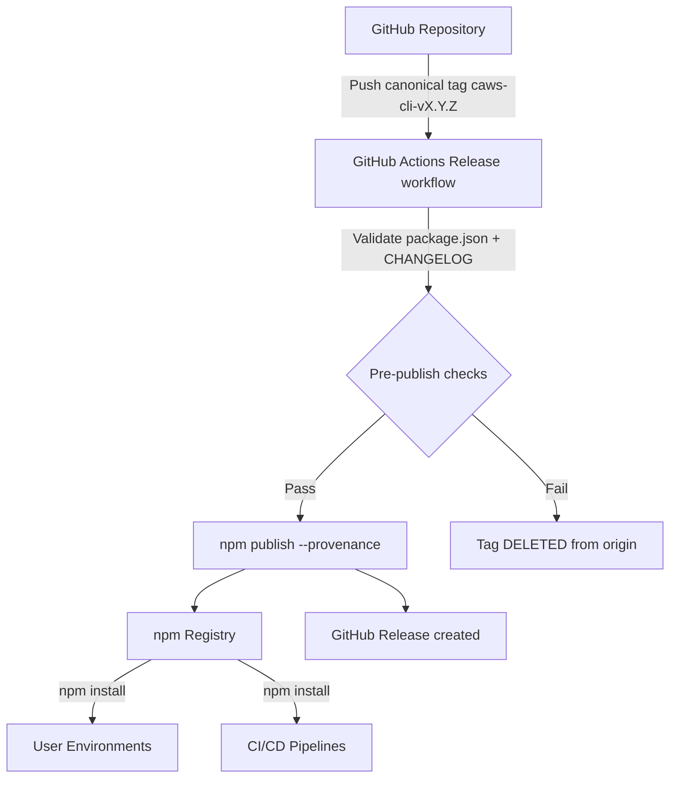
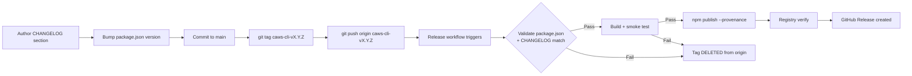

# CAWS Production Deployment Guide

**Author**: @darianrosebrook  
**Last Updated**: 2026-05-28  
**Status**: Production Ready

## Overview

This guide covers deploying CAWS to production environments. CAWS is primarily distributed as npm packages, but this guide also covers deployment considerations for teams running internal instances.

---

## Deployment Architecture

### Primary Distribution: npm Registry

CAWS packages are published to npm under the `@paths.design` scope:

- **@paths.design/caws-cli** - Command-line interface (v11.1.6, `latest` dist-tag)
- **@caws/mcp-server** - Model Context Protocol server


```mermaid
graph TB
    A[GitHub Repository] -->|Push canonical tag caws-cli-vX.Y.Z| B[GitHub Actions Release workflow]
    B -->|Validate package.json + CHANGELOG| C{Pre-publish checks}
    C -->|Pass| D[npm publish --provenance]
    C -->|Fail| E[Tag DELETED from origin]
    D --> F[npm Registry]
    F -->|npm install| G[User Environments]
    F -->|npm install| H[CI/CD Pipelines]
    D --> I[GitHub Release created]
```

Branch pushes to `main` do **not** trigger any publish. Releases are tag-driven only.

---

## Prerequisites

### Infrastructure Requirements

| Component   | Requirement | Notes                             |
| ----------- | ----------- | --------------------------------- |
| **Node.js** | >= 18.0.0   | Per `package.json` engines field; CI runs Node 22 |
| **npm**     | >= 10.0.0   | For package management            |
| **Git**     | >= 2.30.0   | Required by CAWS for repo state           |
| **Storage** | 100 MB      | For CLI and dependencies          |
| **Memory**  | 512 MB      | Minimum for CLI operations        |

### Network Requirements

- **Outbound HTTPS** to npm registry (registry.npmjs.org)
- **Outbound HTTPS** to GitHub (for updates and provenance)
- **DNS Resolution** for npm and GitHub domains

---

## Installation Methods

### Method 1: Global Installation (Recommended for CLI)

```bash
# Install globally for system-wide access
npm install -g @paths.design/caws-cli

# Verify installation
caws --version

# Check health
caws status
```

### Method 2: Project-Local Installation

```bash
# Install as project dependency
cd your-project
npm install --save-dev @paths.design/caws-cli

# Use via npx
npx caws --version

# Or via npm scripts in package.json
npx caws doctor
```

### Method 3: Docker Container (Optional)

```dockerfile
# Dockerfile for CAWS CLI
FROM node:22-alpine

# Install CAWS CLI
RUN npm install -g @paths.design/caws-cli

# Set working directory
WORKDIR /workspace

# Entry point
ENTRYPOINT ["caws"]
CMD ["--help"]
```

```bash
# Build container
docker build -t caws-cli .

# Run CAWS in container
docker run -v $(pwd):/workspace caws-cli doctor
```

---

## Environment Configuration

### Required Environment Variables

Create `.env` file from `.env.example`:

```bash
cp .env.example .env
```

**For Development**:

```bash
# Minimal development setup
CAWS_WORKING_DIR=/path/to/project
NODE_ENV=development
```

**For CI/CD**:

```bash
# CI environment
CI=true
NODE_ENV=test
CAWS_SPEC_ID=<feature-spec-id>
```

**For Production Services**:

```bash
# Production MCP server
CAWS_ENABLE_MONITORING=true
CAWS_LOG_LEVEL=info
NODE_ENV=production
```

### Secrets Management

**Never commit secrets to version control.**

**GitHub Actions**:

```yaml
# Set in repository settings → Environments → Release
secrets:
  NPM_TOKEN: ${{ secrets.NPM_TOKEN }}
  GITHUB_TOKEN: ${{ secrets.GITHUB_TOKEN }}
```

**Local Development**:

```bash
# Use environment variables or .env (gitignored)
export NPM_TOKEN="npm_xxxxx"
```

**Container Orchestration**:

```yaml
# Kubernetes secrets
apiVersion: v1
kind: Secret
metadata:
  name: caws-secrets
type: Opaque
data:
  npm-token: <base64-encoded-token>
```

---

## Release Process

Releases are **tag-driven and human-explicit** (CAWS-RELEASE-TAG-DRIVEN-001). CI does not decide when to publish, what version to publish, or what to put in the CHANGELOG. The maintainer makes all three decisions manually, then pushes a canonical tag. See **`docs/release-procedure.md`** for the full procedure including failure recovery; the summary below is for orientation only.

### How it works


```mermaid
graph LR
    A[Author CHANGELOG section] --> B[Bump package.json version]
    B --> C[Commit to main]
    C --> D[git tag caws-cli-vX.Y.Z]
    D --> E[git push origin caws-cli-vX.Y.Z]
    E --> F[Release workflow triggers]
    F --> G{Validate package.json<br>+ CHANGELOG match}
    G -->|Pass| H[Build + smoke test]
    H -->|Pass| I[npm publish --provenance]
    I --> J[Registry verify]
    J --> K[GitHub Release created]
    G -->|Fail| L[Tag DELETED from origin]
    H -->|Fail| L
```

**What CI does NOT do:**
- Modify `package.json` or `CHANGELOG.md`
- Commit anything back to `main`
- Trigger on `push: branches: [main]` — there is no such trigger

### Tag conventions

| Tag pattern | Outcome |
|---|---|
| `caws-cli-vX.Y.Z` | **Accepted** — triggers publish |
| `caws-kernel-v*` | **Refused and deleted** — kernel publishes manually in v1 |
| `v*` (bare) | **Refused and deleted** — legacy convention, auto-cleaned |

**Never push a bare `v*` tag** — it gets auto-deleted by the workflow.

### Asymmetric failure invariant

| Failure stage | Tag handling | Registry |
|---|---|---|
| Pre-publish (validate / build / smoke / publish) | Tag **DELETED** | Untouched |
| Post-publish (registry-verify / GitHub Release) | Tag **PRESERVED** | Has the version |

When a pre-publish step fails, delete-and-retag. When a post-publish step fails, the workflow emits a repair command — run it; do not retag.

### Publish authentication

Publish uses `NPM_TOKEN` (a granular npm token stored in the `Release` GitHub environment). OIDC trusted-publishing is a planned future follow-up; `id-token: write` is retained in the workflow for that purpose but is not the current publish mechanism. `npm publish --provenance` is used for supply chain attestation.

### Quick reference: releasing caws-cli

```bash
# 1. Author CHANGELOG section in packages/caws-cli/CHANGELOG.md
# 2. Bump packages/caws-cli/package.json version
# 3. Commit
git add packages/caws-cli/CHANGELOG.md packages/caws-cli/package.json
git commit -m "chore(release): caws-cli 11.1.7"
git push origin main   # Does NOT publish

# 4. Tag and push the tag (THIS triggers the release)
git tag caws-cli-v11.1.7 -m "Release caws-cli 11.1.7"
git push origin caws-cli-v11.1.7

# 5. Watch the workflow
gh run watch

# 6. Verify
npm view @paths.design/caws-cli@11.1.7 version
```

---

## Deployment Verification

### Post-Deployment Checks

```bash
# 1. Verify package is published
npm view @paths.design/caws-cli version

# 2. Test installation in clean environment
docker run --rm -it node:22-alpine sh -c "npm install -g @paths.design/caws-cli && caws --version"

# 3. Verify provenance
npm audit signatures

# 4. Run smoke tests (v11 surface)
caws --help
caws doctor --help
caws status --help
caws gates --help
```

### Health Check Script

```bash
#!/bin/bash
# caws-health-check.sh

set -e

echo "CAWS Health Check"
echo "================="

# Check CLI is installed
if ! command -v caws &> /dev/null; then
    echo "❌ CAWS CLI not found"
    exit 1
fi

# Check version
VERSION=$(caws --version)
echo "✅ CAWS version: $VERSION"

# Check basic commands
caws --help > /dev/null && echo "✅ CLI responding"

# Check in a test project (v11)
mkdir -p /tmp/caws-test
cd /tmp/caws-test
git init > /dev/null 2>&1
caws init > /dev/null 2>&1 || true
caws doctor && echo "✅ Doctor working"

# Cleanup
rm -rf /tmp/caws-test

echo "================="
echo "✅ All health checks passed"
```

---

## Rollback Procedures

### Scenario 1: Broken Release on npm

**Option A: Deprecate (Recommended)**

```bash
# Deprecate broken version
npm deprecate @paths.design/caws-cli@11.1.6 "Broken release, use 11.1.5"

# Users on npm install will get warning
# Users on specific version need to manually downgrade
```

**Option B: Unpublish (Within 72 hours only)**

```bash
# Unpublish recent version (npm allows within 72 hours)
npm unpublish @paths.design/caws-cli@11.1.6

# WARNING: This breaks anyone who already installed it
```

**Option C: Publish Hotfix**

```bash
# Fastest option: fix, commit, retag
git revert <bad-commit>
git commit -m "fix: rollback breaking change"
git push origin main   # Does NOT publish

# Bump version and CHANGELOG, then tag
git tag caws-cli-v11.1.7 -m "Release caws-cli 11.1.7"
git push origin caws-cli-v11.1.7
# CI will build, validate, and publish 11.1.7
```

### Scenario 2: Pre-publish CI Failure

```bash
# Tag was auto-deleted by the workflow — fix the underlying issue first
# (check workflow logs via: gh run list --workflow=release.yml)

# After fixing (package.json version, CHANGELOG, or build issue):
git tag caws-cli-v11.1.7 -m "Release caws-cli 11.1.7"
git push origin caws-cli-v11.1.7
```

### Scenario 3: Emergency Stop

```bash
# If release workflow is in progress, cancel via GitHub UI
# GitHub UI > Actions > Cancel workflow run

# Then fix issue and retag
```

---

## Monitoring & Observability

### Metrics to Track

**Package Metrics**:

- Download count (npmjs.com dashboard)
- Version adoption rate
- Install success rate

**Quality Metrics**:

- Test coverage (>80%)
- Mutation score (>50%)
- Security audit results (0 high/critical)

**Performance Metrics**:

- CLI startup time (<500ms)
- Command execution time
- Bundle size (<3 MB)

### Monitoring Tools

**npm Package Stats**:

```bash
# Check download stats
npm view @paths.design/caws-cli

# Check recent versions
npm view @paths.design/caws-cli versions --json
```

**GitHub Actions**:

- Monitor workflow success rate
- Track build times
- Review security alerts

**Optional: Custom Monitoring**

```javascript
// Add to MCP server or CLI
const metrics = {
  commandExecutions: new Counter('caws_command_total'),
  executionDuration: new Histogram('caws_command_duration_seconds'),
  errors: new Counter('caws_errors_total'),
};

// Export to Prometheus, DataDog, etc.
```

---

## Scaling Considerations

### For npm Packages (Current)

**Advantages**:

- npm CDN handles all traffic
- Global distribution
- No infrastructure to manage
- Automatic caching

**Limitations**:

- Download size (currently 2.37 MB, acceptable)
- npm registry availability (99.9% uptime)

### For Hosted Services (Future)

If deploying CAWS as a hosted service:

**Load Balancing**:

```yaml
# Example Kubernetes deployment
apiVersion: apps/v1
kind: Deployment
metadata:
  name: caws-service
spec:
  replicas: 3
  selector:
    matchLabels:
      app: caws
  template:
    spec:
      containers:
        - name: caws
          image: caws-service:latest
          resources:
            requests:
              memory: '512Mi'
              cpu: '250m'
            limits:
              memory: '1Gi'
              cpu: '500m'
```

**Horizontal Scaling**:

- Stateless design allows easy horizontal scaling
- Each instance independent
- No shared state

**CDN for Static Assets**:

```bash
# If serving documentation/assets
# Use Cloudflare, Fastly, or AWS CloudFront
```

---

## Disaster Recovery

### Backup Strategy

**Source Code**:

- GitHub serves as primary backup
- All releases tagged in git with canonical `caws-cli-vX.Y.Z` format
- Full history preserved

**npm Registry**:

- npm maintains all published versions
- Cannot delete versions after 72 hours
- Automatic mirroring by npm

**Documentation**:

- Stored in git repository
- Rendered on GitHub Pages (optional)
- Backed up with source code

### Recovery Procedures

**Scenario: GitHub Unavailable**

```bash
# npm packages remain available
# Users can still install from npm
# No new releases until GitHub restored
```

**Scenario: npm Registry Unavailable**

```bash
# Existing installations unaffected
# New installs fail temporarily
# Use npm mirror or wait for restoration
```

**Scenario: Complete Loss**

```bash
# Worst case: Rebuild from git history
git clone https://github.com/Paths-Design/coding-agent-working-standard
npm install
npm run build
npm publish --force
```

---

## Security Hardening

### npm Security

```bash
# Enable 2FA on npm account
npm profile enable-2fa auth-and-writes

# Use granular automation tokens (not user tokens)
# Rotate tokens every 90 days
# Store token in GitHub Environments → Release → NPM_TOKEN

# Provenance is included via: npm publish --provenance
# Configured in scripts/release-tag-publish.mjs (not .releaserc.json)
```

### CI/CD Security

```yaml
# GitHub Actions security
permissions:
  contents: write  # Required for tag deletion on pre-publish failure
  id-token: write  # Retained for future OIDC trusted-publisher adoption

# Publish uses NPM_TOKEN (granular token in Release environment)
env:
  NPM_TOKEN: ${{ secrets.NPM_TOKEN }}
```

### Supply Chain Security

```bash
# Verify package signatures
npm audit signatures

# Check SLSA provenance
gh attestation verify @paths.design/caws-cli

# Scan for vulnerabilities
npm audit --audit-level=high
```

---

## Troubleshooting

### Common Issues

**Issue: npm publish fails with 403**

```bash
# Solution: Check npm token permissions
npm whoami
npm token list

# Regenerate if needed (granular token with bypass-2FA for write actions)
# Update NPM_TOKEN in GitHub → Settings → Environments → Release
```

**Issue: Tag pushed but workflow deleted it immediately**

```bash
# Cause: Tag matched a refused pattern (bare v*, caws-kernel-v*, or malformed caws-cli-v*)
# or pre-publish validation failed (package.json version vs tag mismatch,
# or CHANGELOG missing the version section)

# Check workflow logs:
gh run list --workflow=release.yml
gh run view <run-id>

# Fix the underlying issue, then retag with the canonical convention:
git tag caws-cli-vX.Y.Z -m "Release caws-cli X.Y.Z"
git push origin caws-cli-vX.Y.Z
```

**Issue: Package not found after publish**

```bash
# Solution: Wait for npm CDN propagation (usually <5 minutes)
# Check status
npm view @paths.design/caws-cli

# Force update registry cache
npm cache clean --force
```

**Issue: Version mismatch in CI**

```bash
# Solution: Ensure all workflows use Node >= 18 (engines field minimum)
# CI runs Node 22; local dev must meet >=18.0.0
# Check .github/workflows/*.yml for node-version
```

---

## Support & Contacts

- **Deployment Issues**: hello@paths.design
- **Security Issues**: security@paths.design
- **GitHub Issues**: https://github.com/Paths-Design/coding-agent-working-standard/issues
- **npm Package**: https://www.npmjs.com/package/@paths.design/caws-cli

---

## Appendix

### Deployment Checklist

- [ ] All tests passing
- [ ] Security audit clean
- [ ] Lint checks passing
- [ ] Documentation updated
- [ ] CHANGELOG section authored for this version
- [ ] `package.json` version bumped to match target tag
- [ ] Canonical tag pushed (`caws-cli-vX.Y.Z`)
- [ ] Release workflow passed (no pre-publish failure)
- [ ] npm package published and registry-verified
- [ ] GitHub Release created with CHANGELOG body
- [ ] Provenance attestation included (`npm audit signatures`)
- [ ] Health checks passing
- [ ] Monitoring configured
- [ ] Rollback plan documented
- [ ] Team notified

### Resources

- [docs/release-procedure.md](release-procedure.md) — full canonical release procedure (CAWS-RELEASE-TAG-DRIVEN-001)
- [npm Publishing Best Practices](https://docs.npmjs.com/packages-and-modules/contributing-packages-to-the-registry)
- [SLSA Provenance](https://slsa.dev/provenance/)
- [GitHub OIDC](https://docs.github.com/en/actions/deployment/security-hardening-your-deployments/about-security-hardening-with-openid-connect)

---

**Last Updated**: 2026-05-28  
**Next Review**: August 2026
