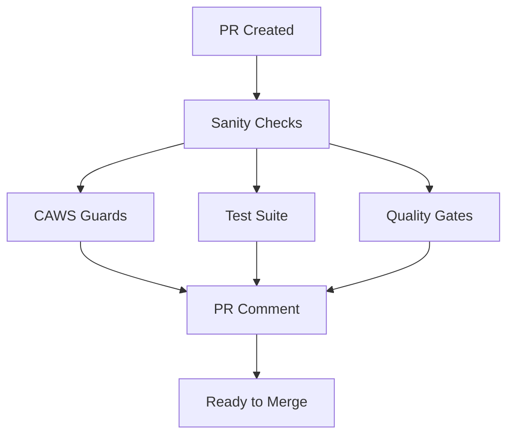

# CAWS Hook Strategy

> **Author**: @darianrosebrook  
> **Purpose**: Define optimal placement of quality checks across development lifecycle

## 🎯 Core Principle

**Check at the right time, not all the time.**

Fast checks run early (pre-commit), comprehensive checks run before merge (CI/CD).

---

## 📋 Hook Placement Matrix

| Check Type | Pre-Commit | Pre-Push | PR (CI) | Pre-Deploy |
|------------|:----------:|:--------:|:-------:|:----------:|
| **Naming conventions** | ✅ | - | ✅ | - |
| **Linting** | ✅ Staged | - | ✅ Full | - |
| **Type checking** | ✅ | - | ✅ | - |
| **Unit tests** | ❌ | ✅ | ✅ Full | - |
| **Contract tests** | ❌ | ✅ | ✅ | - |
| **Integration tests** | ❌ | ❌ | ✅ | - |
| **E2E tests** | ❌ | ❌ | ✅ Smoke | ✅ Full |
| **Mutation tests** | ❌ | ❌ | ✅ | - |
| **A11y tests** | ❌ | ❌ | ✅ | - |
| **CAWS validation** | ❌ | ✅ | ✅ | - |
| **Scope guards** | ❌ | ⚠️  Warning | ✅ Hard fail | - |
| **Budget guards** | ❌ | ❌ | ✅ | - |
| **Build verification** | ❌ | ✅ | ✅ | ✅ |
| **Performance budgets** | ❌ | ❌ | ✅ | ✅ |

**Legend**:
- ✅ = Enforced (hard fail)
- ⚠️  = Warning only
- ❌ = Not checked

---

## 🔧 Implementation Details

### 1. Pre-Commit Hook (Client-Side)

**Goal**: Catch trivial errors instantly

```bash
# .git/hooks/pre-commit
- Naming conventions (< 1s)
- Lint staged files only (< 5s)
- Type checking (< 10s)
- Common issues (debugger, etc.)
```

**Why**:
- Immediate feedback
- Prevents bad commits
- Keeps git history clean
- Fast enough to not interrupt flow

**When to skip**: `git commit --no-verify` for WIP commits

### 2. Pre-Push Hook (Client-Side)

**Goal**: Ensure local quality before sharing

```bash
# .git/hooks/pre-push
- CAWS validation (< 5s)
- Unit tests + coverage (< 30s)
- Contract tests (< 20s)
- Build verification (< 15s)
- Scope compliance (warning)
```

**Why**:
- Catches issues before pushing
- Prevents broken main branch
- Faster than waiting for CI
- Developer gets immediate feedback

**When to skip**: `git push --no-verify` for force-pushing fixes

### 3. Pull Request Checks (CI/CD)

**Goal**: Comprehensive quality gates before merge

```yaml
# .github/workflows/pr-checks.yml
Jobs (parallel):
  1. Sanity (fail fast):
     - Lint full codebase
     - Type check
     - Build

  2. CAWS Guards:
     - Naming conventions
     - Spec validation
     - Scope compliance (hard fail)
     - Budget enforcement

  3. Test Suite:
     - Unit tests (full coverage)
     - Contract tests
     - Integration tests
     - E2E smoke tests

  4. Quality Gates:
     - Mutation testing
     - Accessibility testing
     - Performance budgets

  5. PR Summary:
     - Generate comment
     - Post to PR
```

**Why**:
- Clean environment (no local state)
- Auditable record
- Required status checks
- Parallel execution
- Comprehensive coverage

**Cannot skip**: Required for merge

### 4. Pre-Deploy/Release (CI/CD)

**Goal**: Final verification + automated release

```yaml
# .github/workflows/release.yml
On push to main:
  1. Full verification
  2. Production build
  3. Automated versioning
  4. Publish to npm
  5. Deploy
```

**Why**:
- Ensures main is always deployable
- Automates release process
- Maintains supply chain integrity
- Generates provenance

**Cannot skip**: Automated on merge

---

## 🚀 Performance Optimization

### Parallel Execution Strategy



**Benefits**:
- ~3x faster than sequential
- Fail fast on linting
- Independent job failures
- Better resource utilization

### Caching Strategy

```yaml
- uses: actions/cache@v4
  with:
    path: |
      ~/.npm
      node_modules
      .turbo
    key: ${{ runner.os }}-${{ hashFiles('**/package-lock.json') }}
```

**Results**:
- 50-80% faster CI runs
- Lower npm registry load
- Consistent environments

---

## 🎓 Best Practices

### 1. **Progressive Enhancement**

Start simple, add complexity as needed:

```bash
# Day 1: Basic pre-commit
- Naming conventions
- Lint staged files

# Week 1: Add pre-push
+ Unit tests
+ Build verification

# Month 1: Comprehensive CI
+ All test types
+ CAWS guards
+ Quality gates
```

### 2. **Escape Hatches**

Always provide overrides for urgent fixes:

```bash
# Skip client hooks (emergency only)
git commit --no-verify
git push --no-verify

# Override in spec (auditable)
human_override:
  enabled: true
  rationale: "Production hotfix - bypass mutation testing"
  waived_gates: ["mutation", "manual_review"]
  expires_at: "2025-10-08T00:00:00Z"
```

### 3. **Developer Experience**

Keep feedback loops tight:

```bash
# Good: Instant feedback
Pre-commit: < 15s

# Good: Quick local validation  
Pre-push: < 60s

# Good: Fail fast
CI Sanity: < 2min

# Acceptable: Comprehensive gates
CI Full: < 10min
```

### 4. **Cost Optimization**

```yaml
# Only run expensive tests when needed
test_mutation:
  if: |
    github.event_name == 'pull_request' &&
    (contains(github.event.pull_request.labels.*.name, 'high-risk') ||
     github.base_ref == 'main')
```

---

## 🔍 Monitoring & Metrics

Track hook effectiveness:

```bash
# Pre-commit catch rate
Prevented commits: 347
Most common: debugger statements (156), naming violations (98)

# Pre-push catch rate  
Prevented pushes: 89
Most common: failing tests (52), build errors (31)

# CI catch rate
Failed PRs: 23
Most common: scope violations (12), budget exceeded (7)
```

**Goal**: Catch 80% of issues pre-push, 95% in CI

---

## 📖 Related Documentation

- [CAWS Developer Guide](./caws-developer-guide.md) - Overall workflow
- [Commit Conventions](../COMMIT_CONVENTIONS.md) - Message format
- [Quality Gates](./api/quality-gates.md) - Gate definitions

---

## 💡 FAQ

### Q: Why not run all tests pre-commit?

**A**: Developer experience. Pre-commit should be < 15s for immediate feedback. Full test suites belong in CI where they run in parallel and don't block flow.

### Q: Can I skip hooks for WIP commits?

**A**: Yes, use `--no-verify` for local WIP. But CI will still enforce all gates before merge.

### Q: What if CI is too slow?

**A**: Parallelize jobs, cache dependencies, and only run expensive tests (mutation, E2E) for high-risk changes or main branch.

### Q: Should experimental code skip gates?

**A**: Yes, use `experimental_mode` in your spec to reduce requirements for sandbox code. Expires automatically to prevent abuse.

---

**Last Updated**: 2025-10-01  
**Next Review**: 2025-11-01


