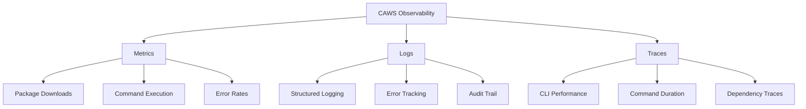

# CAWS Monitoring & Observability

**Author**: @darianrosebrook  
**Last Updated**: October 10, 2025  
**Status**: Production Ready

## Overview

This document covers monitoring, observability, and health checks for CAWS in production environments. While CAWS is primarily an npm package, proper monitoring ensures reliability and helps detect issues early.

---

## Monitoring Strategy

### Three Pillars of Observability



---

## Health Checks

### CLI Health Check

```bash
#!/bin/bash
# caws-health-check.sh
# Run this periodically to verify CAWS CLI health

set -e

echo "🏥 CAWS Health Check"
echo "===================="
echo ""

# Check 1: CLI is installed
echo "1. Checking CLI installation..."
if ! command -v caws &> /dev/null; then
    echo "   ❌ CAWS CLI not found in PATH"
    exit 1
fi
echo "   ✅ CLI found"

# Check 2: Version check
echo "2. Checking version..."
VERSION=$(caws --version 2>&1 || echo "ERROR")
if [[ "$VERSION" == "ERROR" ]]; then
    echo "   ❌ Failed to get version"
    exit 1
fi
echo "   ✅ Version: $VERSION"

# Check 3: Help command responds
echo "3. Checking help command..."
if ! caws --help > /dev/null 2>&1; then
    echo "   ❌ Help command failed"
    exit 1
fi
echo "   ✅ Help command works"

# Check 4: Basic commands available
echo "4. Checking core commands..."
COMMANDS=("validate" "status" "diagnose" "evaluate" "iterate")
for cmd in "${COMMANDS[@]}"; do
    if ! caws $cmd --help > /dev/null 2>&1; then
        echo "   ❌ Command '$cmd' not available"
        exit 1
    fi
    echo "   ✅ $cmd available"
done

# Check 5: Performance check (CLI startup time)
echo "5. Checking performance..."
START=$(node -e 'console.log(Date.now())')
caws --version > /dev/null 2>&1
END=$(node -e 'console.log(Date.now())')
DURATION=$((END - START))
if [ $DURATION -gt 1000 ]; then
    echo "   ⚠️  Slow startup: ${DURATION}ms (expected <500ms)"
else
    echo "   ✅ Startup time: ${DURATION}ms"
fi

# Check 6: Dependency integrity
echo "6. Checking dependencies..."
if npm list -g @paths.design/caws-cli --depth=0 > /dev/null 2>&1; then
    echo "   ✅ Dependencies intact"
else
    echo "   ⚠️  Dependency issues detected"
fi

echo ""
echo "===================="
echo "✅ Health check complete"
exit 0
```

### MCP Server Health Check

```javascript
// mcp-server-health.js
// Health check for CAWS MCP server

const http = require('http');
const { execSync } = require('child_process');

async function checkMCPServer() {
  const checks = {
    cliAvailable: false,
    commandsWork: false,
    performanceOK: false,
  };

  try {
    // Check 1: CLI available
    execSync('caws --version', { stdio: 'pipe' });
    checks.cliAvailable = true;

    // Check 2: Commands work
    execSync('caws --help', { stdio: 'pipe' });
    checks.commandsWork = true;

    // Check 3: Performance check
    const start = Date.now();
    execSync('caws --version', { stdio: 'pipe' });
    const duration = Date.now() - start;
    checks.performanceOK = duration < 500;

    const allHealthy = Object.values(checks).every((v) => v);

    return {
      status: allHealthy ? 'healthy' : 'degraded',
      checks,
      timestamp: new Date().toISOString(),
    };
  } catch (error) {
    return {
      status: 'unhealthy',
      checks,
      error: error.message,
      timestamp: new Date().toISOString(),
    };
  }
}

// Optional: Expose health endpoint
if (require.main === module) {
  checkMCPServer().then((health) => {
    console.log(JSON.stringify(health, null, 2));
    process.exit(health.status === 'healthy' ? 0 : 1);
  });
}

module.exports = { checkMCPServer };
```

---

## Metrics Collection

### Package Metrics

**npm Package Stats**:

```bash
#!/bin/bash
# collect-npm-metrics.sh

PACKAGE="@paths.design/caws-cli"

# Get package info
INFO=$(npm view $PACKAGE --json)

# Extract metrics
VERSION=$(echo "$INFO" | jq -r '.version')
DOWNLOADS_LAST_WEEK=$(npm view $PACKAGE downloads --json | jq -r '.["last-week"]' 2>/dev/null || echo "N/A")
LATEST_PUBLISH=$(echo "$INFO" | jq -r '.time.modified')

cat <<EOF
{
  "package": "$PACKAGE",
  "version": "$VERSION",
  "downloads_last_week": "$DOWNLOADS_LAST_WEEK",
  "last_published": "$LATEST_PUBLISH",
  "timestamp": "$(date -u +%Y-%m-%dT%H:%M:%SZ)"
}
EOF
```

### CLI Usage Metrics (Optional)

For teams wanting to track internal usage:

```javascript
// packages/caws-cli/src/utils/telemetry.js
/**
 * Optional telemetry for teams tracking internal usage
 * Disabled by default, respects user privacy
 *
 * @author @darianrosebrook
 */

const fs = require('fs');
const path = require('path');
const os = require('os');

class Telemetry {
  constructor() {
    this.enabled = process.env.CAWS_TELEMETRY_ENABLED === 'true';
    this.endpoint = process.env.CAWS_TELEMETRY_ENDPOINT || null;
  }

  /**
   * Record command execution (local only, no external calls)
   */
  recordCommand(command, duration, success) {
    if (!this.enabled) return;

    const record = {
      command,
      duration,
      success,
      timestamp: new Date().toISOString(),
      version: require('../../package.json').version,
      nodeVersion: process.version,
      platform: os.platform(),
    };

    // Write to local log file only
    const logFile = path.join(os.tmpdir(), 'caws-metrics.jsonl');
    fs.appendFileSync(logFile, JSON.stringify(record) + '\n');
  }

  /**
   * Get local metrics summary
   */
  getSummary() {
    if (!this.enabled) return null;

    const logFile = path.join(os.tmpdir(), 'caws-metrics.jsonl');
    if (!fs.existsSync(logFile)) return null;

    const lines = fs.readFileSync(logFile, 'utf8').trim().split('\n');
    const records = lines.map((line) => JSON.parse(line));

    return {
      total_executions: records.length,
      success_rate: records.filter((r) => r.success).length / records.length,
      avg_duration: records.reduce((sum, r) => sum + r.duration, 0) / records.length,
      commands: [...new Set(records.map((r) => r.command))],
    };
  }
}

module.exports = new Telemetry();
```

---

## Structured Logging

### Log Levels

| Level     | Use Case             | Example                                      |
| --------- | -------------------- | -------------------------------------------- |
| **ERROR** | Failures, exceptions | "Failed to parse working-spec.yaml"          |
| **WARN**  | Recoverable issues   | "Deprecated flag used: --old-flag"           |
| **INFO**  | Important events     | "Validation complete: 0 errors"              |
| **DEBUG** | Detailed debugging   | "Loaded config from .caws/working-spec.yaml" |

### Log Format (JSON)

```javascript
// Structured logging format
{
  "timestamp": "2025-10-10T14:30:00.000Z",
  "level": "INFO",
  "message": "Validation complete",
  "command": "validate",
  "duration": 120,
  "errors": 0,
  "warnings": 2,
  "metadata": {
    "spec_file": ".caws/working-spec.yaml",
    "risk_tier": 1,
    "version": "3.4.0"
  }
}
```

### Implementation (Future Enhancement)

```javascript
// packages/caws-cli/src/utils/logger.js
const pino = require('pino');

const logger = pino({
  level: process.env.CAWS_LOG_LEVEL || 'info',
  transport: {
    target: 'pino-pretty',
    options: {
      colorize: true,
      translateTime: 'SYS:standard',
      ignore: 'pid,hostname',
    },
  },
});

module.exports = logger;
```

---

## Error Tracking

### Sentry Integration (Optional)

```javascript
// packages/caws-cli/src/utils/error-tracking.js
const Sentry = require('@sentry/node');

if (process.env.SENTRY_DSN) {
  Sentry.init({
    dsn: process.env.SENTRY_DSN,
    environment: process.env.NODE_ENV || 'development',
    release: `caws-cli@${require('../../package.json').version}`,
    beforeSend(event, hint) {
      // Strip sensitive information
      if (event.request) {
        delete event.request.cookies;
        delete event.request.headers;
      }
      return event;
    },
  });
}

function captureError(error, context = {}) {
  if (process.env.SENTRY_DSN) {
    Sentry.captureException(error, { extra: context });
  }
  // Always log locally too
  console.error(error);
}

module.exports = { captureError };
```

---

## Performance Monitoring

### CLI Performance Budgets

```javascript
// packages/caws-cli/tests/perf-budgets.test.js
describe('Performance Budgets', () => {
  test('CLI startup time < 500ms', async () => {
    const start = Date.now();
    execSync('node dist/index.js --version', { stdio: 'pipe' });
    const duration = Date.now() - start;

    expect(duration).toBeLessThan(500);
  });

  test('Validation command < 2s', async () => {
    const start = Date.now();
    execSync('node dist/index.js validate', { stdio: 'pipe' });
    const duration = Date.now() - start;

    expect(duration).toBeLessThan(2000);
  });

  test('Bundle size < 3 MB', () => {
    const stats = fs.statSync('dist-bundle/index.js');
    const sizeMB = stats.size / (1024 * 1024);

    expect(sizeMB).toBeLessThan(3);
  });
});
```

### Continuous Monitoring

```yaml
# .github/workflows/performance-monitoring.yml
name: Performance Monitoring

on:
  push:
    branches: [main]
  schedule:
    - cron: '0 0 * * *' # Daily

jobs:
  performance:
    runs-on: ubuntu-latest
    steps:
      - uses: actions/checkout@v4
      - uses: actions/setup-node@v4
        with:
          node-version: '22'

      - name: Install dependencies
        run: npm ci

      - name: Build
        run: npm run build

      - name: Run performance tests
        run: npm run perf:budgets

      - name: Bundle size check
        run: |
          SIZE=$(du -sm packages/caws-cli/dist-bundle | cut -f1)
          echo "Bundle size: ${SIZE}MB"
          if [ $SIZE -gt 5 ]; then
            echo "❌ Bundle too large: ${SIZE}MB > 5MB"
            exit 1
          fi

      - name: Report metrics
        run: |
          cat <<EOF > performance-report.json
          {
            "date": "$(date -u +%Y-%m-%d)",
            "bundle_size_mb": $SIZE,
            "startup_time_ms": $STARTUP_TIME,
            "commit": "${{ github.sha }}"
          }
          EOF
```

---

## Alerts & Notifications

### GitHub Actions Notifications

```yaml
# .github/workflows/notify-on-failure.yml
name: Failure Notifications

on:
  workflow_run:
    workflows: ['Release']
    types: [completed]

jobs:
  notify:
    if: ${{ github.event.workflow_run.conclusion == 'failure' }}
    runs-on: ubuntu-latest
    steps:
      - name: Create GitHub Issue
        uses: actions/github-script@v7
        with:
          script: |
            github.rest.issues.create({
              owner: context.repo.owner,
              repo: context.repo.repo,
              title: '🚨 Release Pipeline Failed',
              body: 'Release workflow failed. Please investigate.',
              labels: ['bug', 'priority:high', 'ci/cd']
            })
```

### Metrics to Alert On

| Metric                  | Threshold           | Action                             |
| ----------------------- | ------------------- | ---------------------------------- |
| **CLI startup time**    | >1s                 | Investigate performance regression |
| **Bundle size**         | >5MB                | Review dependencies, optimize      |
| **Test failure rate**   | >5%                 | Fix flaky tests                    |
| **Security audit**      | High/Critical vulns | Immediate patch                    |
| **npm publish failure** | Any                 | Manual intervention                |

---

## Dashboards

### npm Package Dashboard

Monitor at [npmjs.com](https://www.npmjs.com/package/@paths.design/caws-cli):

- Download trends
- Version adoption
- Dependency graph

### GitHub Insights

Monitor at GitHub repository:

- CI/CD success rate
- PR merge time
- Issue response time
- Security advisories

### Custom Dashboard (Optional)

For teams running internal CAWS infrastructure:

```javascript
// dashboard/server.js
const express = require('express');
const app = express();

app.get('/health', async (req, res) => {
  const health = await checkMCPServer();
  res.json(health);
});

app.get('/metrics', async (req, res) => {
  const metrics = {
    cli_version: execSync('caws --version').toString().trim(),
    uptime: process.uptime(),
    memory: process.memoryUsage(),
  };
  res.json(metrics);
});

app.listen(3000, () => {
  console.log('CAWS monitoring dashboard on :3000');
});
```

---

## Incident Detection

### Automatic Detection

```bash
#!/bin/bash
# cron job: */5 * * * * /usr/local/bin/caws-monitor.sh

# Check npm package availability
if ! npm view @paths.design/caws-cli version > /dev/null 2>&1; then
    echo "ALERT: npm package unavailable" | mail -s "CAWS Alert" ops@paths.design
fi

# Check GitHub API
if ! curl -sf https://api.github.com/repos/Paths-Design/coding-agent-working-standard > /dev/null; then
    echo "ALERT: GitHub repository unavailable" | mail -s "CAWS Alert" ops@paths.design
fi

# Check CI/CD status
STATUS=$(gh run list --limit 1 --json conclusion -q '.[0].conclusion')
if [ "$STATUS" = "failure" ]; then
    echo "ALERT: CI/CD pipeline failing" | mail -s "CAWS Alert" ops@paths.design
fi
```

---

## Best Practices

### DO

- ✅ Monitor CLI startup time
- ✅ Track bundle size over time
- ✅ Set up security alerts
- ✅ Monitor npm download trends
- ✅ Test health checks regularly

### DON'T

- ❌ Collect user data without consent
- ❌ Track individual users
- ❌ Send telemetry by default
- ❌ Expose sensitive metrics publicly
- ❌ Ignore security alerts

---

## Resources

- **Deployment Guide**: `docs/DEPLOYMENT.md`
- **Rollback Guide**: `docs/ROLLBACK.md`
- **npm Package**: https://www.npmjs.com/package/@paths.design/caws-cli
- **GitHub Actions**: https://github.com/Paths-Design/coding-agent-working-standard/actions

---

## Support

For monitoring issues or questions:

- **Email**: hello@paths.design
- **GitHub Issues**: [Report an issue](https://github.com/Paths-Design/coding-agent-working-standard/issues)

---

**Last Updated**: October 10, 2025  
**Next Review**: January 2026
